# SPOTIFY-BASED BILLBOARD PREDICTIONS

## Introduction

The music industry has evolved rapidly over the past two decades, shifting from physical album sales to digital downloads and now, streaming platforms. With over 120,000 tracks released daily (Music Business Worldwide, 2023), competition for visibility is fierce. Platforms like Spotify have become central to music discovery and often act as early indicators of commercial success. Meanwhile, the Billboard Hot 100 remains one of the most recognized measures of cultural and commercial impact (Hakanen, 2008; Muhammad & Hudrasyah, 2016). This project explores the question: Can Spotify features predict whether a song will appear on the Billboard Hot 100? The motivation lies in discovering whether measurable musical and listener engagement characteristics can reveal patterns that distinguish charting songs from non-charting ones. Such insights could inform record labels, producers, and artists on how to position and promote songs more effectively in today’s streaming-driven marketplace. The inputs include Spotify’s audio and metadata features (such as danceability, tempo, and popularity) paired with a binary Billboard label identifying whether a track charted. The output is a prediction of chart success, along with insights into which features most influence that outcome.

## Abstract
This project develops a machine learning model to predict whether a song will chart on the Billboard Hot 100 using Spotify audio and metadata. By examining patterns in musical attributes and listener engagement, the study explores how these factors align with a song’s commercial performance. The combined dataset of Spotify metrics and Billboard outcomes is used to train and evaluate classification algorithms, assessing both predictive accuracy and interpretability. The goal is to uncover which characteristics are most closely linked to chart success and to show how streaming-era data can reveal the connection between creativity, audience behavior, and commercial impact in today’s music industry.

## Related Works
With the rate the music industry is growing and the uncertainty that surrounds taming the way music “popularizes”, predicting how music becomes a hit has become a growing interest for both researchers and industry professionals (Music Business Worldwide, 2023).  Interiano et al. (2018) analyzed over 500,000 tracks (1985–2015) using regression and time-series methods, finding that hit patterns in features like danceability and energy shift culturally. Muhammad & Hudrasyah (2016) used regression and correlation to link promotional activity and artist visibility to Billboard charting. While both studies highlight the role of non-musical factors, they focus more on correlation than prediction.
Moving from correlation-based approaches to predictive modeling, Araujo et al. (2019) used logistic regression and random forests to differentiate “hits” from “non-hits” based on Spotify features. However, while they were successful in achieving moderate accuracy, their model was limited to predicting hits based on Spotify’s popularity score. Contrastingly, Gutiérrez et al. (2020) used an approach that balanced the bias by studying Spotify and YouTube Music datasets with methods, including decision trees, random forests, and gradient boosting, to predict song success. But while their approach reduced platform-specific bias, their definition of a “hit” itself was subjective, as it relied on popularity scores. Both of the two models that had a similar approach to ours, like us, faced issues with limited interpretability because of class imbalance.
Our project, unlike previous studies that mainly targeted Spotify’s internal “popularity” ratings, used the “Billboard Hot 100” chart appearance, which is widely regarded as one of the most reliable measures of global music popularity and a model of a universal ranking system (Hakanen, 2008). Furthermore, in contrast to random undersampling or oversampling techniques used in older work, we implement stratified sampling and SMOTE resampling to manage severe class imbalance while preserving data diversity. Finally, our approach to compare multiple models and select XGBoost improves both predictive accuracy and interpretability. This positions our study as both an analytical and practical advancement in understanding how streaming-era data predicts real-world chart success.

## Data Description
We took Spotify data from Kaggle with additional data scraped from Billboard’s website to create our dataset. The Spotify data (Joshi, Parolkar, & Das, 2023) consists of approximately 1 million tracks released from 2000 to 2023. It includes 19 features as detailed with their respective definitions in Table 1. To obtain data on rankings of songs and artists, we scraped all tracks that have entered the Billboard Hot 100 (Billboard, 2025) since 2000 and recorded each track’s peak chart position. From that dataset, keep only unique artists–track pairs starting on January 1, 2000, until December 31, 2023. This data includes approximately 10,000. Details about features are located in Table 2. 
The relevant engineered/synthetic features we created include the following: 

Artist_hit_rate: represents the proportion of an artist’s songs in the dataset that have previously appeared on the Billboard Hot 100
Artist_track_count: represents the total number of songs by an artist in the dataset  
Audio_intensity: represents a song’s overall intensity by averaging other features in the dataset (danceability, energy, valence, acousticness, instrumentalness, liveness, and speechness)
Energy_valence_interaction: represents the product when multiplying a song’s Spotify energy and valence scores, showing overall energy and upbeatness of a song 

For modeling, we applied a stratified 80/20 train-test split to preserve the class balance between hits and non-hits, using a fixed random state of 13 for reproducibility. Cross-validation was implemented through a 3-fold randomized search CV during hyperparameter tuning, ensuring a reliable evaluation without the need for a separate validation set. To improve efficiency, we occasionally sampled 30% of the full dataset and further reduced it to 10% during intensive tuning while maintaining class proportions throughout. This approach provided an efficient and balanced framework for evaluating model performance on an imbalanced classification problem.

## Methods
In early analysis, we attempted multiple methods; bagging, logistic regression and XGBoost. Our intention was to identify which model provided the most accurate results on the test data, but this also allowed us to check that no model produced wildly different results. As our research centered on predicting a binary result (Billboard hit or not), all three models seemed feasible options. However, the bagging and logistical regression models had some flaws.

Bootstrap aggregation models create multiple training sets from the original data, which can work well for smaller data sets. But despite the small proportion of Billboard hits, we were working with a lot of data, so this advantage was lost. Bagging also generally creates a more stable, robust prediction due the number of smaller models it has aggregated together, but this comes at a loss of interpretability. We were able to rank the most important features with a random forest bagging model, but we were not able to establish levels of significance. 

Logistic regression is best used for binary classification problems. However, it handles categorical columns with dummy-coding, which did not work well with our data. Genre (one of our categorical features) consisted of over 80 different genres, and running a logistical regression on each of those would have been extremely inefficient. So instead of starting with single variable logistic regressions, we attempted running a model with almost all the variables, disregarding artist-name and track-name as there were simply too many to try to dummy-encode. As we could not include artist-name, which we knew from our bagging model was the most important feature, we knew logistic regression would not work as a final model. Instead of splitting our data into test-train sets,we ran a single logistic model with all of the data to confirm that the other features, as identified by bagging and XGBoost, were ranked correctly.
We ultimately selected XGBoost as our primary model due to its superior performance and interpretability. XGBoost builds an ensemble of decision trees sequentially, where each tree corrects the errors of the previous ones, allowing it to learn complex, nonlinear relationships efficiently. This characteristic made it well-suited for our data, which involved a mix of numeric and categorical columns, large sets of data, and contained correlated and sometimes sparse features. Its built-in handling of missing values, feature weighting, and regularization parameters further contributed to its effectiveness. When compared to other models like bagging and logistic regression, indicating it was more effective at identifying potential hits while maintaining generalization. The main advantage of XGBoost in this context is its ability to uncover subtle, nonlinear interactions while maintaining computational efficiency.
One lingering problem was the strong class imbalance in our data, but our implementation of stratified sampling and SMOTE resampling managed that. However, the model’s complexity comes with trade-offs: it’s less interpretable than linear models and can overfit if not carefully tuned. Nevertheless, its predictive strength and the insights provided through SHAP analysis made it the most appropriate choice for understanding what differentiates charting songs from the millions that don’t and for predicting Billboard Hits.

## Results
After settling on XGBoost as our modeling method, we began with a baseline application. Following examples from class, this first model served as a reference point for later iterations. As expected, the model performed very well on the majority class (songs that did not chart), achieving 0.99 precision, 0.983 recall, and a 0.991% F1-score. However, performance dropped off sharply on the minority class (songs that did chart), where precision was 0.197, recall was 0.830, and the F1-score was 0.318.
What stood out most was the low precision: when the model predicted “this song will chart,” it was correct less than one in five times. In other words, it frequently produced false alarms. Of course, this reflects the natural trade-off between precision and recall. And in our case, this trade-off has real-world implications. The Billboard Hot 100 only has a fixed number of spots each week, which means many songs may hover near the cutoff but fail to make it for reasons outside the model’s scope. Thus, false positives are not necessarily useless, as they may highlight songs with commercial potential that could succeed given the right timing, promotion, or support. Although we’ll discuss more details on this motivation in the next section. 
To make the trade-off easy, we pushed the model toward lower precision in exchange for higher recall. This involved tracking the cut-off points for our data and manually choosing a threshold that was on the lower end. Additional modeling suggested that a cut-off between 0.08 and 0.1 was ideal as it was consistent with a high recall strategy, capturing 80-90% of hits (Fig. 5).
During tuning, we quickly realized that even when working with a smaller stratified sample, the model still had its issues. Attempting to search across too many hyperparameters often caused the program to crash, run for hours, or overwhelm available CPU. This forced us to constrain our tuning ranges, knowing it would introduce some bias and limit the scope of results.
Given this, we focused tuning on parameters most relevant to balancing precision and recall. For example, increasing the number of trees too far risks overfitting, which would hurt precision when given new data. Allowing deeper trees could improve recall by capturing rare hit patterns, but at the risk of memorizing noise and reducing precision. Thus, our adjustments were designed to target precision while keeping recall within a reasonable range. While the tuned baseline achieved a lower precision, we deemed the impact on the F-1 score to be too extreme (drop from 0.244 to 0.190) (Fig. 3). 
Thus, we used a SMOTE model, a method that caters to highly imbalanced data. By generating synthetic examples of the minority class, the model should pay more attention to the patterns of actual hits. In addition, we expanded beyond the baseline models by introducing engineered artist-level features such as “artist track count,” “artist hit rate,” and “artist experience.” These fields captured prior artist success and activity, which we expected to provide stronger predictive signals than raw track-level data alone. It’s important to note that engineered fields were created from speculation of fields and attributes we felt would influence Billboard. 
The baseline SMOTE model produced a precision of 0.223, a recall of 0.787, and an F1-score of 0.347. After hyper-tuning (in a process similar to the one described above), recall improved substantially to 0.971, precision dropped to 0.219, and had an F1-score of 0.219 (Fig. 3).
We ultimately selected the optimized SMOTE model based on supporting evidence from both the AUC-PR/ROC curves and SHAP analysis. While the baseline model achieved a slightly higher ROC (Fig. 2), the optimized SMOTE model delivered much stronger recall even at the expense of precision and F1-score. But, SHAP accuracy remained high at 0.97, confirming the model’s stability and showing that it successfully predicted more of the “near-miss” hits that the baseline failed to capture (Fig. 4). Out of curiosity, we removed our engineered field to see the impact on the model. When we removed artist-specific information, such as the artist’s name and past performance, the model’s performance dropped dramatically, with precision falling from 0.123 to 0.014, recall from 0.971 to 0.913, and F1 from 0.219 to 0.028. This decline suggests that historical artist performance plays a critical role in predicting chart success.

## Discussion
The top five predictors include the following features: artist_hit_rate (46.7%), popularity (24%), year (5.6%), instrumentalness (3.8%), and artist_track_count (3.23%) (Fig. 1). Given that artist hit rate accounts for nearly half of the prediction of whether a song will chart followed by popularity, it shows the strength of having prior historical success and the impact of features that aren’t necessarily focused on the nature of the musical features themselves. Thus, newer artists may have difficulty charting and, therefore, breaking into the competitive industry. This still offers valuable insight for emerging artists as they can work toward gaining visibility by playing the long-term game of building their musical portfolio and look toward likely future success by building for themselves a consistent history of music. Similarly, while not as strong predictors as that of artist hit rate and popularity, other features still proved to be impactful. For example, when artist hit rate and popularity were dropped, our model revealed that the following features were top predictors: instrumentalness, mode, and acousticness (Fig. 7). As a result, emerging artists can still boost their chances of appearing on the Billboard Hot 100 by focusing on these technical, musical features, and thus in this way cause the industry to become an equalizer when competing against established artists. 
We intentionally tuned the model towards a lower precision, allowing for more false positives to capture potential hits that might otherwise be overlooked. Although we aimed for a balanced model that effectively identified Billboard hits while maintaining reasonable precision. This approach enabled the model to correctly predict 80–90% of true hits (Fig. 5). Consequently, our model flagged a high number of false positives (i.e. songs that did not chart in reality yet were being predicted as charting). This aligns with our strategic objective as these false positives may actually represent commercially valuable opportunities for industry executives and stakeholders to identify songs with latent potential that could chart with additional promotion, investment, etc. This could also be beneficial for emerging artists when pitching themselves to labels as the false positives could serve as a tool for identifying upcoming talent based on the musical qualities of their songs, as discussed earlier, given that they have not yet had the proper exposure that comes with the top predictors of artist hit rate and popularity.   

When creating our model, we encountered some potential biases. For example, it's important to note that the nature of the Billboard Hot 100 does not only include audio features but it also takes into account streaming activity, radio airplay, and sales (Trust, 2013). Thus, our approach only looks at a portion of the true representation of predicting a Billboard Hot 100. Additionally, another area of bias can be found within the feature entitled ‘popularity’ as the metrics for how Spotify classifies and calculates its popularity score on a scale from 0-100 is unclear. Based on speculation from other researchers, it seems that total streams, recency, listener engagement, and playlist performance may impact the company’s calculation (Peker, 2021) (“Spotify Popularity: The Secret to Leverage the Algorithm”) (“Why Spotify's Popularity Index Matters to You, the Musician”). Furthermore, we were also limited by the computing power of our technology given the large dataset of approximately 1 million songs. This caused us to be unable to offer an extensive hyperparameter tuning approach and thus introduced performance tradeoffs such as favoring higher efficiency rather than a better balance between precision and recall. 

## Conclusion and Future Work
This project aimed to find data-driven solutions to the challenge of standing out among the vast number of music releases. We explored whether measurable Spotify song features could predict a song’s likelihood of charting on the Billboard Hot 100. By training multiple models, we found that the XGBoost model with SMOTE oversampling performed best. Results showed that artist_hit_rate and popularity were the strongest predictors, indicating an artist’s history and popularity heavily influence charting. Removing these factors revealed that musical features like instrumentalness, key, genre, and mode also show meaningful patterns. These features, like for many one-time-hit songs that have charted, can be used as a strategy for musical production and promotion for emerging artists to make their music popular.
The future work on this topic could expand this study in many different ways. We could start by better understanding Spotify’s popularity metrics to understand its impact on charting more clearly. Incorporating additional data sources like promotional strategies, social media engagement, or geographical area-based differences could also make the study more interpretable and generalizable. Lastly, the model’s real-world accuracy could be tested by applying it to predict the charting potential of new or upcoming releases. For instance, evaluating predictions on Taylor Swift’s new album “The Life of a Showgirl” and checking the likelihood of it charting to see the model’s practical value in forecasting chart success.

#APPENDICES

Contributions 
Introduction: C. Carlson
Related Work: C. Bajracharya
Methods: C. Carlson
Results: C. Carlson
Conclusion and Future work: C. Bajracharya
Modeling: C. Carlson

## Appendix images: 

# Figure 1 - Predicted features with the most importance
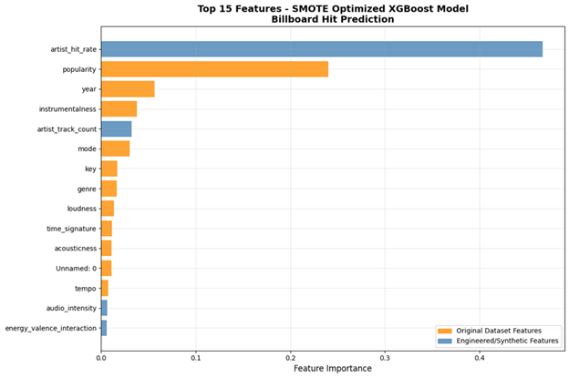

# Figure 2 - ROC curve
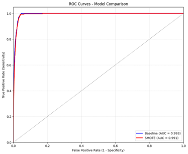

# Figure 3 - Model Confusion Matrix
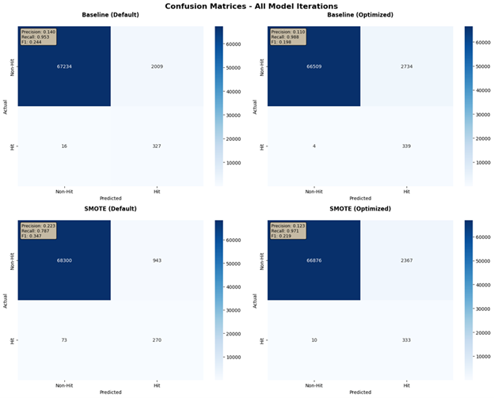

# Figure 4  - SHAP matrix
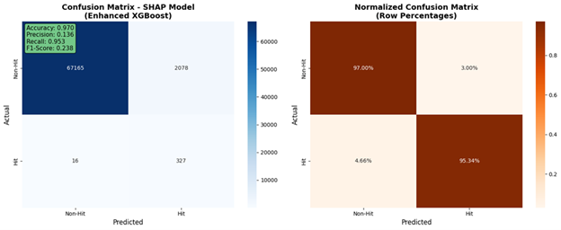

# Figure 5 - Threshold Analysis
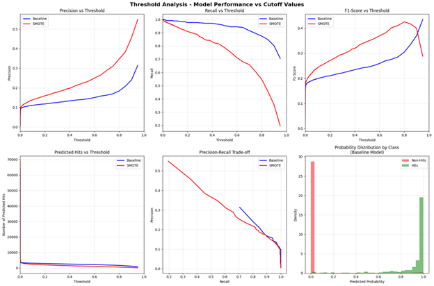

# Figure 6 - SHAP feature results
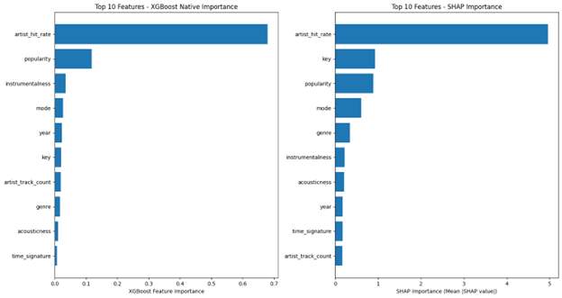

# Figure 7 - SHAP feature results (Con.)
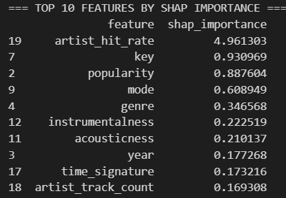

# Figure 8 - Model without engineered artist fields
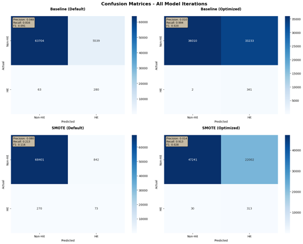

# Figure 9 - ROC curve of the Model without engineered fields
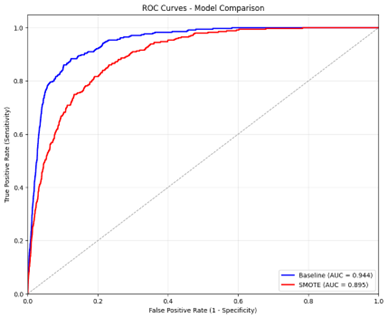

## Appendix Tables:

# Table 1 - Spotify Features from original dataset
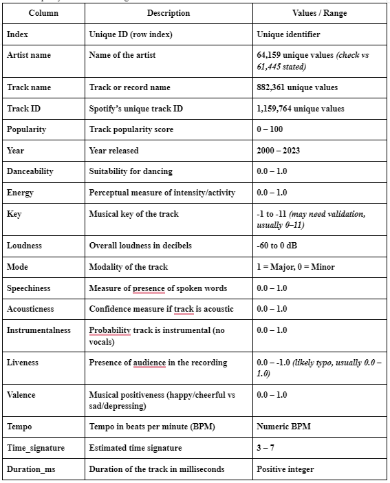

# Table 2 - Billboard features from web scraping
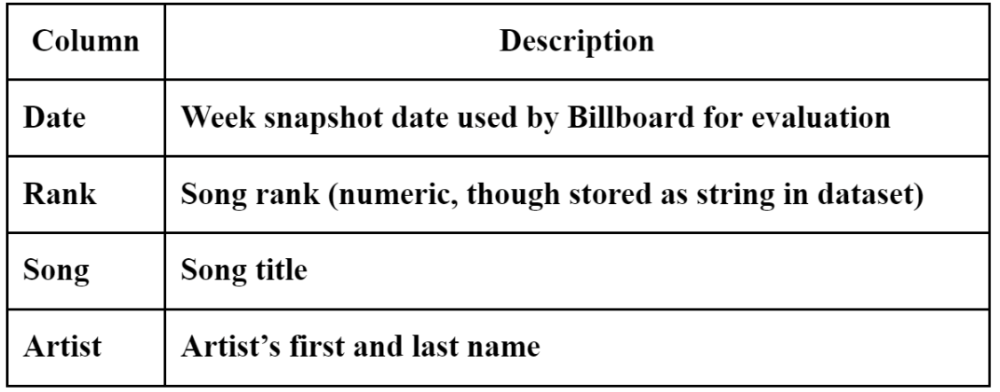

Code 
Provided separately, includes all models and allows the attached graphs/tables to be recreated

Bibliography
Araujo, C. V., Pinhei, M. A., & Giusti, R. (2019). Predicting Music Popularity Using Music Charts. 18th IEEE 
International Conference On Machine Learning And Applications (pp. 59-864). Boca Raton: IEEE International Conference On Machine Learning And Applications (ICMLA).

Billboard. (2025). Billboard Hot 100. Retrieved September 2025, from https://www.billboard.com/charts/hot-100/2000-01-01/ 

Georgieva, E., Suta, M., & Burton, N. (n.d.). HitPredict: Predicting hit songs using Spotify data. Stanford University, USA.

Gutiérrez, D. M., Peñaloza, G. H., Hernández, A. B., & García, F. Á. (2020). A Multimodal End-to-End Deep Learning Architecture for Music Popularity Prediction. IEEE Access, 39361-39374.

Hakanen, E. A. (2008). Counting down to number one: the evolution of the meaning of popular music charts. Cambridge University Press - Popular Music, 17(1), 95 - 111.

Interiano, M., Kazemi, K., Wang, L., Yang, J., Yu, Z., & Komarova, N. (2018). Musical trends and predictability of success in contemporary songs in and out of the top charts. Royal Society Open Science.

International Federation of the Phonographic Industry. (2023, December 11). IFPI’s global study finds we’re listening to more music in more ways than ever. Retrieved from International Federation of the Phonographic Industry: https://www.ifpi.org/ifpis-global-study-finds-were-listening-to-more-music-in-more-ways-than-ever/

Joshi, A., Parolkar, A., & Das, V. (2023). Spotify 1 Million Tracks Dataset. Retrieved from Kaggle: https://www.kaggle.com/datasets/amitanshjoshi/spotify-1million-tracks

Khalil, H., Wainer, G., & Dick, K. (2022, October 10). Can big data really predict what makes a song popular? The Conversation. United States: The Conversation.

Muhammad, R. M., & Hudrasyah, H. (2016). Television advertisement comparative analysis: The use of songs from Hot 100 Billboard chart and non-Hot 100 Billboard chart. Journal of Business and Management, 5(4), 540-555.
Music Business Worldwide. (2023, March 6). There are now 120,000 new tracks hitting music streaming services each day. Retrieved from Music Business Worldwide: https://www.musicbusinessworldwide.com/there-are-now-120000-new-tracks-hitting-music-streaming-services-each-day/

Pecker, Philip. (2021, June 25). Predicting popularity on Spotify: When data needs culture more than culture 
needs data. Towards Data Science. https://towardsdatascience.com/predicting-popularity-on-spotify-when-data-needs-culture-more-than-culture-needs-data-2ed3661f75f1/

Scheff, J., & Kotler, P. (2000). Standing room only: Strategies for marketing the performing arts. Boston: Harvard Business School Press.

Soh, H., Hong, J., Jeong, J., & Jeong, H. (2024, June 17). Long-term memory on popularity dynamics: insights from the Billboard Hot 100 chart. Journal of Statistical Mechanics: Theory and Experiment, 064001.

Spotify Popularity: The Secret to Leverage the Algorithm. LoudLab. 
https://www.loudlab.org/blog/spotify-popularity-leverage-algorithm/.
Statista. (2019, August 21). Music consumption in the U.S. Retrieved from Statista: https://www.statista.com/chart/10185/music-consumption-in-the-us/?srsltid=AfmBOor1QDt1H9w3XctsexULVhFGZISt__Ops6fB8A9TdOIKEfQBnCW6

Trust, Gary. (2013, September 29). Ask Billboard: How does the Hot 100 work? Billboard Pro. 
https://www.billboard.com/pro/ask-billboard-how-does-the-hot-100-work/. 

Why Spotify’s popularity index matters to you, the musician. Musiversal. 
https://musiversal.com/blog/what-is-spotify-popularity-index. 

# Notice of AI Assistance
 Note code for this project was AI assisted. Some code snippets were generated using OpenAI's GPT-4 model to enhance efficiency and address specific coding challenges. All AI-generated code was reviewed, tested, and modified by the authors to ensure accuracy and alignment with project goals.

